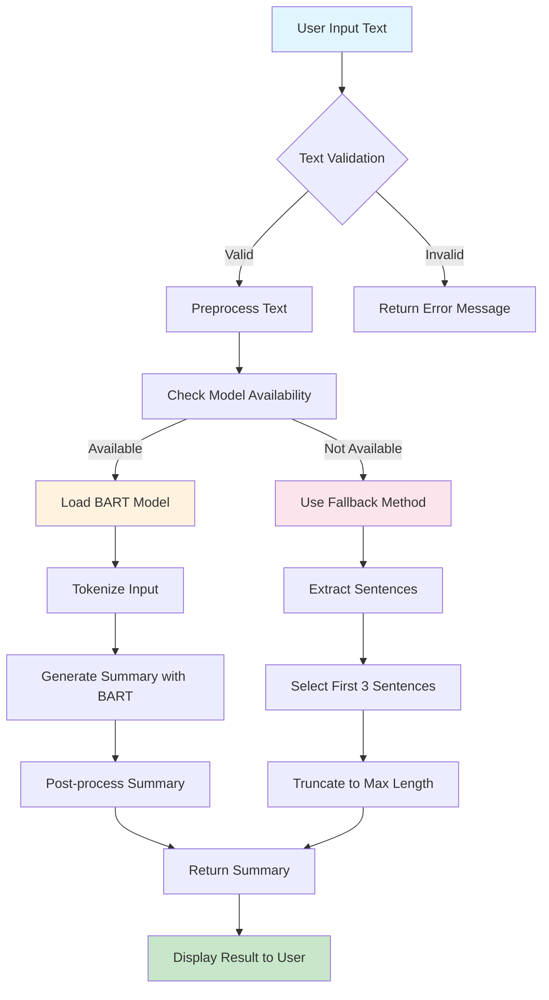
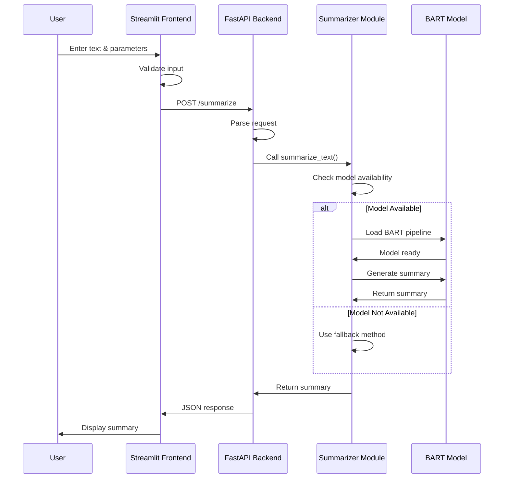
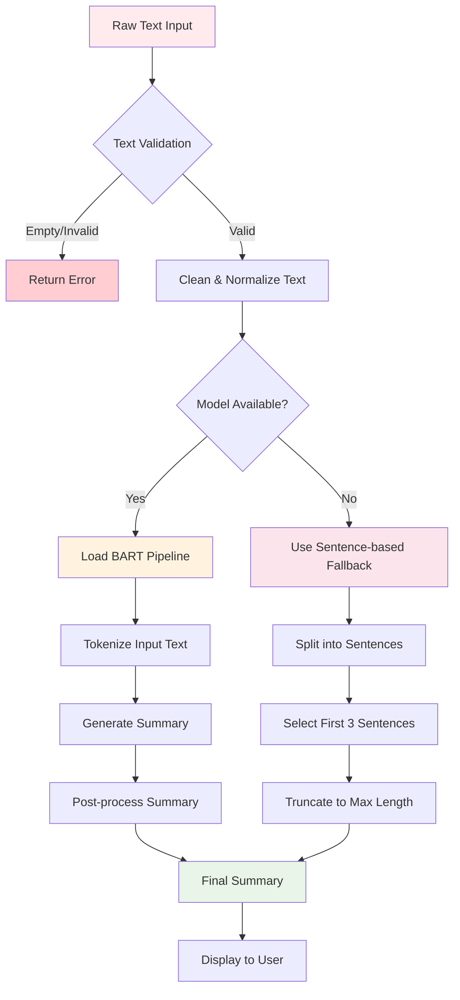
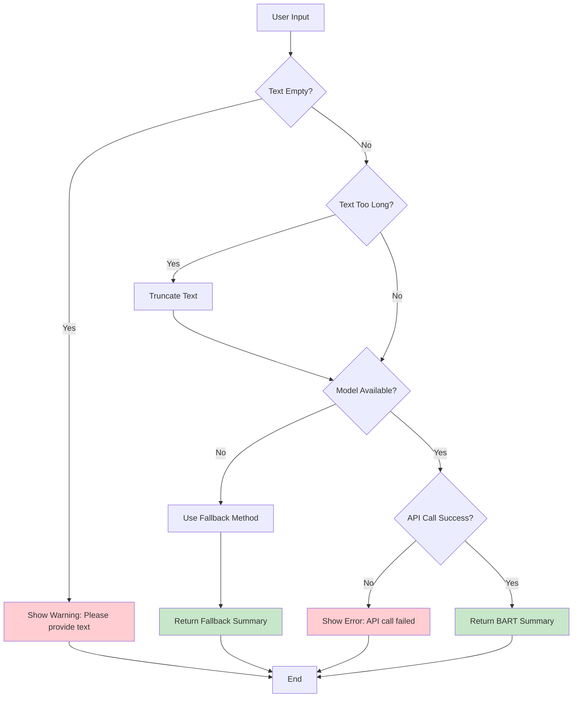
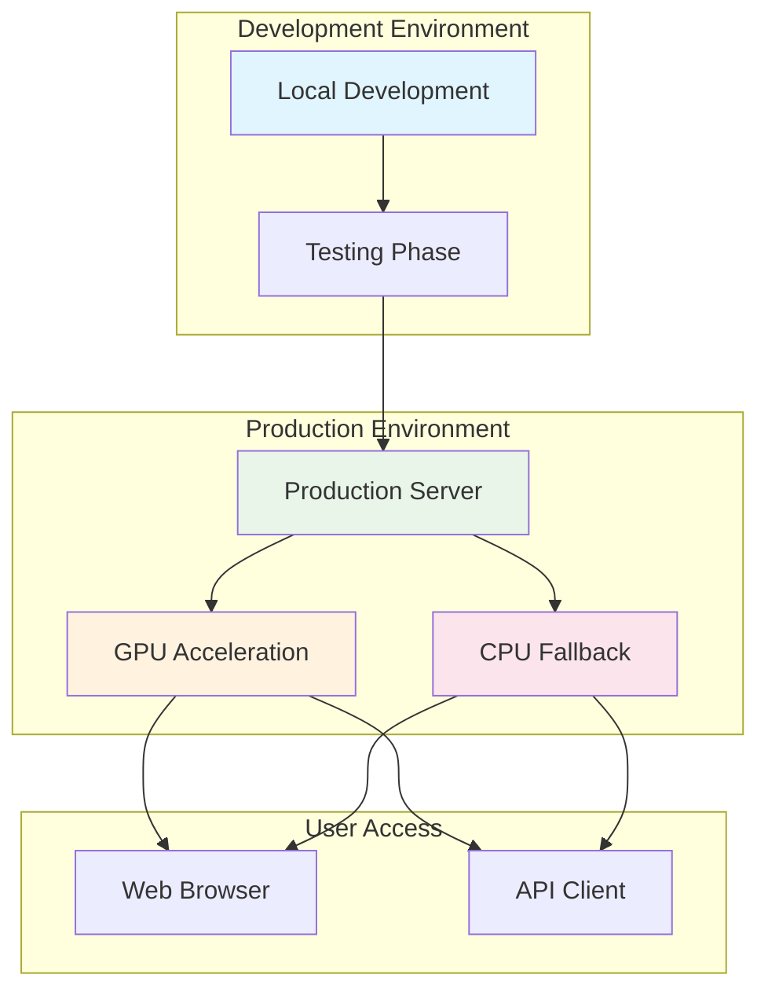
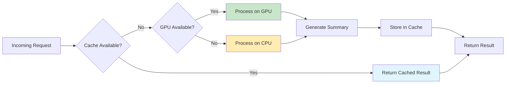
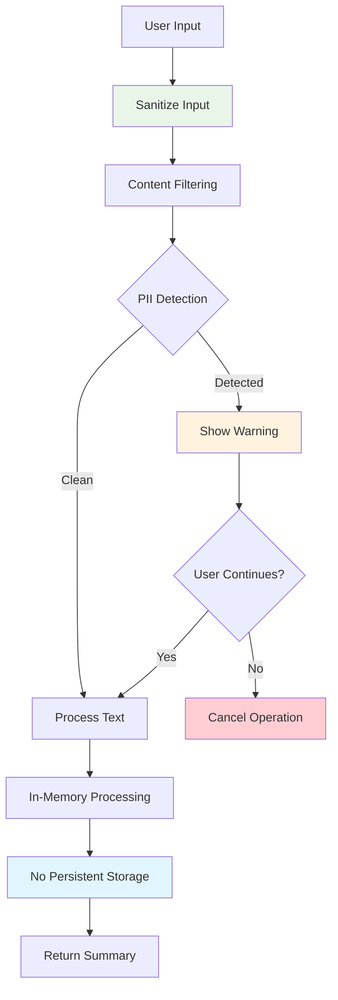
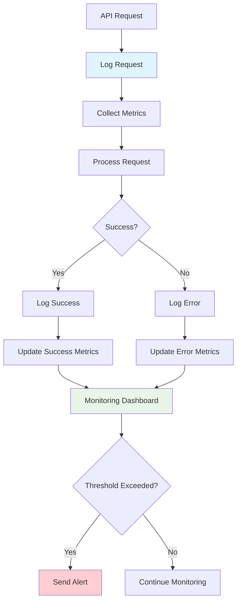
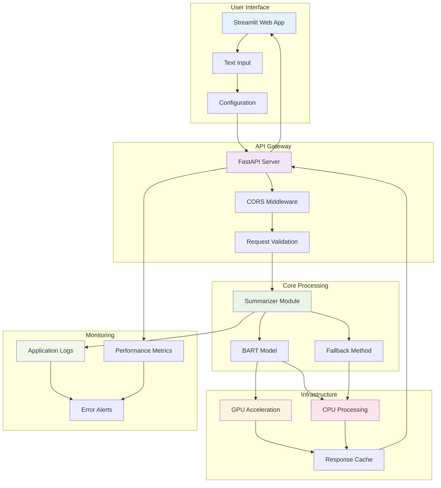

# Text Summarization System Flowchart

## System Architecture Flow



## API Service Flow



## Component Interaction Flow

```mermaid
graph LR
    subgraph "Frontend Layer"
        UI[Streamlit UI]
        INPUT[Text Input Area]
        PARAMS[Length Parameters]
        BUTTON[Summarize Button]
    end
    
    subgraph "API Layer"
        API[FastAPI Server]
        CORS[CORS Middleware]
        ENDPOINT[/summarize]
    end
    
    subgraph "Core Engine"
        ENGINE[Summarizer Module]
        MODEL[BART Model]
        FALLBACK[Fallback Method]
    end
    
    UI --> INPUT
    UI --> PARAMS
    UI --> BUTTON
    BUTTON --> API
    API --> CORS
    CORS --> ENDPOINT
    ENDPOINT --> ENGINE
    ENGINE --> MODEL
    ENGINE --> FALLBACK
    MODEL --> ENGINE
    FALLBACK --> ENGINE
    ENGINE --> ENDPOINT
    ENDPOINT --> UI
    
    style UI fill:#e3f2fd
    style API fill:#f3e5f5
    style ENGINE fill:#e8f5e8
```

## Data Processing Flow



## Error Handling Flow



## Deployment Architecture Flow



## Performance Optimization Flow



## Security and Privacy Flow



## Monitoring and Logging Flow



## Complete System Overview



## Usage Instructions

To view these flowcharts:

1. **Online**: Copy the Mermaid code and paste it into [Mermaid Live Editor](https://mermaid.live/)
2. **VS Code**: Install the Mermaid Preview extension
3. **GitHub**: These will render automatically in GitHub markdown files
4. **Documentation**: Use with MkDocs, GitBook, or other documentation platforms

## Flowchart Descriptions

- **System Architecture Flow**: Shows the main processing pipeline from input to output
- **API Service Flow**: Sequence diagram showing the interaction between components
- **Component Interaction Flow**: How different system components communicate
- **Data Processing Flow**: Detailed data transformation steps
- **Error Handling Flow**: How the system handles various error conditions
- **Deployment Architecture Flow**: System deployment and environment setup
- **Performance Optimization Flow**: Caching and GPU acceleration strategies
- **Security and Privacy Flow**: Data protection and privacy measures
- **Monitoring and Logging Flow**: System monitoring and alerting
- **Complete System Overview**: High-level view of the entire system architecture

